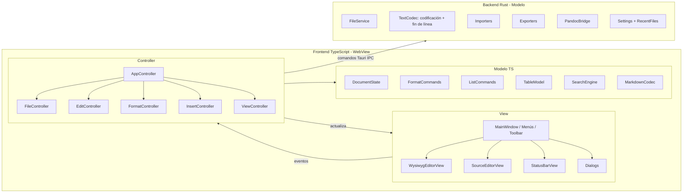

# PLAN.md — Editor Markdown multiplataforma (nombre provisional: **editorMD**)

> Documento vivo. Se actualiza al cerrar cada tarea/fase. Estado de tareas: `[ ]` pendiente · `[~]` en curso · `[x]` hecha · `[-]` descartada.
> Última actualización: 2026-10-03

---

## 1. Objetivo

Aplicación de escritorio **ligera** para editar Markdown en modo **WYSIWYG**, portable a **Windows, Ubuntu, Fedora y macOS**, con **instalador nativo** en cada plataforma. Arquitectura **MVC**, componentes **versionados**, **pruebas unitarias** obligatorias y gestión completa de **codificaciones y finales de línea** para intercambiar ficheros entre sistemas operativos.

Objetivos medibles para la v1.0:

| Métrica | Objetivo |
|---|---|
| RAM en reposo con un documento de 100 KB | ≤ 120 MB (incluido el WebView del sistema) |
| Tamaño del instalador | ≤ 15 MB |
| Arranque en frío | ≤ 1,5 s |
| Cobertura de tests (Modelo + Controlador) | ≥ 85 % de líneas |
| Documento grande (5 MB) | edición sin bloqueos perceptibles |
| Ida y vuelta (abrir → guardar sin editar) | **byte a byte idéntico** en codificación y finales de línea |

---

## 2. Alcance funcional

### 2.1 Requisitos solicitados
| Área | Funciones |
|---|---|
| **Ficheros** | Nuevo, Abrir, Cerrar, Guardar, Guardar como, Importar, Exportar |
| **Edición** | Seleccionar todo, Copiar, Pegar, Buscar, Reemplazar |
| **Formato** | Título 1, Título 2, Título 3, Negrita, Cursiva |
| **Objetos** | Tabla, Lista con viñetas, Lista numerada |
| **Texto plano** | Soporte de varias codificaciones (ASCII, UTF-8…) y finales de línea para intercambiar ficheros entre SO (ver §2.5) |

### 2.2 Añadidos propuestos
**Imprescindible en la v1.0:**
- **Deshacer / Rehacer**, **Cortar**, **Nuevo documento**, **aviso de cambios sin guardar** (marca `*` en el título).
- **Ficheros recientes**.
- **Barra de estado**: línea/columna, palabras, **codificación** y **fin de línea** (ambos pulsables para cambiarlos).
- **Atajos de teclado** estándar de cada SO (Ctrl / ⌘).
- Buscar siguiente/anterior, mayúsculas, palabra completa, regex, **reemplazar todo**.
- Formato extra: Títulos 4–6, Tachado, Código en línea, Bloque de código, Cita, Línea horizontal, Quitar formato.
- Objetos extra: Enlace, Imagen, Lista de tareas, Sangrar/desangrar.
- **Modo código fuente Markdown** (D-12): conmutar entre WYSIWYG y el Markdown en texto. Es la red de seguridad del WYSIWYG.
- **Extras v1.0 (D-05):** tema claro/oscuro, interfaz es/en, autoguardado y recuperación, **pestañas multidocumento** y **barra de accesos directos** con botones para las funciones frecuentes (nuevo, abrir, guardar, previsualizar la exportación, deshacer/rehacer, alternar modo fuente…). Se puede configurar qué botones aparecen.

**Recomendable (v1.x):** resaltado de sintaxis en modo fuente, arrastrar y soltar, imprimir, zoom, panel de esquema, editor visual de tablas avanzado.

**Futuro (v2+):** corrector ortográfico, notas al pie, fórmulas (KaTeX), Mermaid, plantillas, modo sin distracciones, plugins, ejecución de bloques R.

### 2.3 Dialecto y tipos de fichero
- **CommonMark + GFM** (tablas, tachado, tareas, autolinks). *(D-04, asumido)*
- **Front matter YAML** (`---` … `---`): se conserva intacto y se puede editar como bloque.
- Extensiones que se abren como documento: `.md`, `.markdown`, `.mdown`, **`.Rmd`**, `.txt`.
- **R Markdown (`.Rmd`)**: los bloques ```` ```{r ...} ```` y el código R en línea `` `r expr` `` se muestran en el WYSIWYG como **bloques opacos editables** y se guardan **sin alterar** sus opciones. No se ejecuta código R.

### 2.4 Importar / Exportar *(D-03, decidido)*
| Operación | Formatos | Motor |
|---|---|---|
| Importar | `.txt`, `.html` → Markdown | nativo (Rust + turndown/htmd) |
| Importar | `.docx`, `.odt` → Markdown | **Pandoc** (si está instalado; si no, la opción aparece deshabilitada con un aviso) |
| Exportar | `.html` (CSS embebido), `.txt` | nativo |
| Exportar | `.pdf` | **Typst embebido** (D-11) |
| Exportar | `.docx`, `.odt` | **Pandoc** |

Las exportaciones a texto (`.txt`, `.html`, `.md`) permiten elegir **codificación** y **fin de línea** (§2.5).

### 2.5 Codificaciones y finales de línea (intercambio entre SO)

**Codificaciones soportadas (lectura y escritura):**

| Codificación | Uso típico | Notas |
|---|---|---|
| **UTF-8** (sin BOM) | Linux, macOS, web, Git | Valor por defecto para documentos nuevos |
| **UTF-8 con BOM** | Herramientas antiguas de Windows (Bloc de notas clásico, Excel) | |
| **UTF-16 LE / BE** (con BOM) | Algunos programas de Windows | |
| **ASCII (7 bits)** | Máxima compatibilidad | Con pérdida si hay caracteres fuera de ASCII (ver abajo) |
| **ISO-8859-1** (Latin-1) | Sistemas Unix antiguos | |
| **ISO-8859-15** (Latin-9) | Igual que Latin-1, pero con `€` | |
| **Windows-1252** | Windows en español/occidental | |
| **Mac Roman** | Mac clásico (anterior a OS X) | Solo por compatibilidad |

**Finales de línea:** **LF** (Linux/macOS), **CRLF** (Windows), **CR** (Mac clásico). Si un fichero mezcla varios, se avisa y se ofrece normalizarlo.

**Comportamiento:**
1. **Al abrir, detección automática**: BOM → ¿UTF-8 válido? → heurística (`chardetng`) → si falla, Windows-1252. Se detecta también el fin de línea predominante.
2. **Reabrir con codificación…**: por si la detección se equivoca.
3. **Al guardar se conservan la codificación y el fin de línea originales** (ida y vuelta byte a byte).
4. **Guardar con codificación… / Convertir**: elegir codificación, BOM y fin de línea.
5. **Perfiles de exportación rápidos**: «Windows» (UTF-8 con BOM opcional + CRLF), «Linux/macOS» (UTF-8 + LF), «Máxima compatibilidad» (ASCII + CRLF).
6. **Conversión con pérdida**: si el texto tiene caracteres que no caben en la codificación destino (p. ej. `ñ`, `€` o emojis en ASCII), se muestra la lista de caracteres y líneas afectadas y se ofrece:
   cancelar · sustituir por `?` · **transliterar** (`á→a`, `€→EUR`, `ñ→n`) · entidades HTML (solo al exportar a HTML).
7. Configurable en Preferencias: codificación y fin de línea por defecto para documentos nuevos.

Implementación (Rust): `encoding_rs` (Windows-1252, Latin-9, Mac Roman…), `chardetng` (detección) y `deunicode` (transliteración). ASCII, Latin-1 real y la *codificación* UTF-16 se implementan a mano, porque `encoding_rs` sigue el estándar WHATWG, que no codifica UTF-16 y trata Latin-1 como Windows-1252.

---

## 3. Stack tecnológico *(D-01, decidido: Rust + Tauri 2)*

| Pieza | Elección | Motivo |
|---|---|---|
| Shell de escritorio | **Tauri 2** | Binario pequeño, usa el WebView del SO, instaladores integrados en los 4 SO |
| Backend | **Rust** (estable) | E/S, codificaciones, exportación, Pandoc, ajustes |
| Frontend | **TypeScript** + framework ligero (D-13: **Svelte** recomendado, o TS sin framework) | Interfaz y controladores |
| Editor WYSIWYG | **Milkdown** (D-14, recomendado) o Tiptap | Milkdown está basado en ProseMirror + remark y es *Markdown-first*: mejor fidelidad de ida y vuelta |
| Parser/serializador MD | remark (unified) + remark-gfm + remark-frontmatter | El estándar del ecosistema; se usa también para los tests de fidelidad |
| Build frontend | Vite | |
| Tests | `cargo test` + `cargo-llvm-cov` (Rust) · **Vitest** + cobertura v8 (TS) · **WebdriverIO + tauri-driver** (E2E en Windows/Linux) | |

Las opciones descartadas (C++/Qt, Python/PySide6, Rust/Slint, Go/Fyne, Electron, JavaFX) y sus motivos están en el registro de decisiones (§8).

---

## 4. Arquitectura MVC

### 4.1 Principios
- **Modelo** sin dependencias de UI. Se reparte entre:
  - **Rust (servicios de dominio)**: fichero, codificación, fin de línea, importación/exportación, ajustes. Se expone al frontend mediante **comandos Tauri** tipados.
  - **TypeScript (modelo de documento)**: estado del documento, transformaciones de formato, tablas, listas y búsqueda.
- **Vista** pasiva (*Passive View*): componentes Svelte y editor Milkdown. Solo muestran datos y emiten eventos.
- **Controlador** (TypeScript): recibe los eventos de la vista, invoca al modelo y a los servicios Rust y actualiza la vista. Depende de **interfaces** (`IEditorView`, `IBackend`, `IDialogService`) para poder probarse con *mocks*.
- La lógica de formato vive en el Modelo como **comandos puros** sobre el estado del editor (ProseMirror), probables sin DOM.
- El **Markdown en texto** es la fuente de verdad en disco; el WYSIWYG es una proyección. Hay tests de ida y vuelta obligatorios.

### 4.2 Diagrama



### 4.3 Registro de componentes y versiones

Cada componente lleva su propia versión **[Semantic Versioning 2.0.0](https://semver.org/lang/es/)** (ver §10.1), independiente de la versión de la app. Al modificar un componente: se sube su versión aquí, se anota en §4.4 y en STATUS.md.

| ID | Capa | Lado | Componente | Responsabilidad | Versión | Fase |
|---|---|---|---|---|---|---|
| M01 | Modelo | TS | `DocumentState` | Contenido, ruta, modificado, metadatos de codificación/fin de línea | 0.0.0 | F1 |
| M02 | Modelo | TS | `History` | Deshacer/rehacer (adaptador a la historia de ProseMirror) | 0.0.0 | F3 |
| M03 | Modelo | TS | `FormatCommands` | Títulos, negrita, cursiva, tachado, código, cita, quitar formato | 0.0.0 | F4 |
| M04 | Modelo | TS | `ListCommands` | Viñetas, numeradas, tareas, sangrado | 0.0.0 | F5 |
| M05 | Modelo | TS | `TableModel` | Crear, filas/columnas, alineación | 0.0.0 | F5 |
| M06 | Modelo | TS | `SearchEngine` | Buscar/reemplazar | 0.0.0 | F3 |
| M07 | Modelo | TS | `MarkdownCodec` | MD ⇄ documento WYSIWYG (GFM, front matter, bloques Rmd) | 0.0.0 | F1 |
| M08 | Modelo | Rust | `FileService` | Leer/escribir bytes, escritura atómica, permisos | 0.0.0 | F2 |
| M09 | Modelo | Rust | `TextCodec` | Detección y conversión de codificación + fin de línea, BOM, transliteración, informe de pérdidas | 0.0.0 | F2 |
| M10 | Modelo | Rust | `Importers` | TXT, HTML → MD | 0.0.0 | F6 |
| M11 | Modelo | Rust | `Exporters` | HTML, TXT, PDF (MD → Typst → PDF) | 0.0.0 | F6 |
| M12 | Modelo | Rust | `PandocBridge` | Detectar Pandoc; DOCX/ODT ⇄ MD | 0.0.0 | F6 |
| M13 | Modelo | Rust | `Settings` / `RecentFiles` | Preferencias y recientes | 0.0.0 | F2/F7 |
| M14 | Modelo | Rust | `AutosaveService` | Copias periódicas y recuperación tras un cierre inesperado | 0.0.0 | F7 |
| M15 | Modelo | TS | `Workspace` | Colección de documentos abiertos (pestañas), documento activo | 0.0.0 | F7 |
| M16 | Modelo | TS | `I18n` | Catálogos es/en, cambio de idioma | 0.0.0 | F7 |
| V01 | Vista | TS | `MainWindow` | Menús, barra de herramientas, layout | 0.0.0 | F1 |
| V02 | Vista | TS | `WysiwygEditorView` | Editor Milkdown | 0.0.0 | F1 |
| V03 | Vista | TS | `SourceEditorView` | Modo fuente Markdown (CodeMirror 6) | 0.0.0 | F4 |
| V04 | Vista | TS | `StatusBarView` | Posición, palabras, codificación, fin de línea | 0.0.0 | F2 |
| V05 | Vista | TS | `FindReplaceDialog` | | 0.0.0 | F3 |
| V06 | Vista | TS | `InsertDialogs` | Tabla, enlace, imagen, bloque de código | 0.0.0 | F5 |
| V07 | Vista | TS | `EncodingDialog` | Reabrir/guardar con codificación, informe de pérdidas | 0.0.0 | F2 |
| V08 | Vista | TS | `PreferencesDialog` | | 0.0.0 | F7 |
| V09 | Vista | TS | `QuickToolbar` | Barra de accesos directos configurable (guardar, previsualizar…) | 0.0.0 | F4/F7 |
| V10 | Vista | TS | `TabBar` | Pestañas multidocumento | 0.0.0 | F7 |
| V11 | Vista | TS | `ExportPreviewView` | Previsualización de la exportación (PDF/HTML) | 0.0.0 | F6 |
| C01 | Controlador | TS | `AppController` | Ciclo de vida, salida segura | 0.0.0 | F1 |
| C02 | Controlador | TS | `FileController` | Nuevo/abrir/cerrar/guardar/importar/exportar/codificación | 0.0.0 | F2 |
| C03 | Controlador | TS | `EditController` | Portapapeles, selección, deshacer, buscar | 0.0.0 | F3 |
| C04 | Controlador | TS | `FormatController` | | 0.0.0 | F4 |
| C05 | Controlador | TS | `InsertController` | | 0.0.0 | F5 |
| C06 | Controlador | TS | `ViewController` | Modo fuente/WYSIWYG, tema, zoom, preferencias | 0.0.0 | F4/F7 |

### 4.4 Historial de versiones por componente
> Formato: `ID vX.Y.Z (fecha) — cambio`.

- *(vacío)*

### 4.5 Versionado de la aplicación (hitos)
| Versión | Contenido | Fase |
|---|---|---|
| 0.1.0 | Esqueleto MVC, abrir/editar/guardar con codificaciones | F1–F2 |
| 0.2.0 | Edición completa + buscar/reemplazar | F3 |
| 0.3.0 | Formato | F4 |
| 0.4.0 | Objetos | F5 |
| 0.5.0 | Importar/exportar (+ Pandoc) | F6 |
| 0.6.0 | Preferencias, tema, i18n, autoguardado, pestañas, barra de accesos directos | F7 |
| 0.9.0 | Instaladores en los 4 SO (beta) | F8 |
| **1.0.0** | Release estable | F9 |

---

## 5. Estrategia de pruebas

| Nivel | Qué | Herramienta | Criterio |
|---|---|---|---|
| Unitarias Rust | M08–M13 | `cargo test` + `cargo-llvm-cov` | ≥ 95 % |
| Unitarias TS Modelo | M01–M07 | Vitest (sin DOM o con jsdom) | ≥ 95 % |
| Unitarias Controlador | C01–C06 con mocks de vista y backend | Vitest | ≥ 85 % |
| **Fidelidad MD** | Ida y vuelta MD → WYSIWYG → MD con un corpus (CommonMark spec, GFM, Rmd, front matter) | Vitest | Sin cambios semánticos; diferencias de estilo documentadas |
| **Codificaciones** | Ida y vuelta byte a byte de cada codificación × fin de línea × BOM. Detección. Informe de pérdidas. Transliteración | `cargo test` con ficheros *fixture* | 100 % de la matriz |
| Integración | Comandos Tauri reales + sistema de ficheros temporal | `cargo test` / Vitest | Flujos completos |
| E2E | Arranque, menús, abrir/guardar | WebdriverIO + tauri-driver (Win/Linux); manual en macOS | En CI |
| Rendimiento | RAM, arranque, fichero de 5 MB | script | Objetivos de §1 |

Reglas: **ninguna tarea se da por hecha sin sus tests en verde**; TDD en el Modelo; CI (GitHub Actions) con matriz **Windows / Ubuntu / macOS** + contenedor **Fedora**.
Casos borde obligatorios: documento vacío, selección vacía/multilínea, Unicode/emoji/combinantes, CRLF/CR/mixto, BOM, fichero de solo lectura, fichero enorme, toggle doble de formato, bloques Rmd y front matter.

---

## 6. Empaquetado e instaladores (bundler de Tauri)

| SO | Formato | Notas |
|---|---|---|
| Windows 10/11 | `.msi` (WiX) y/o `.exe` (NSIS) | WebView2 incluido o descargado por el instalador. Firma opcional (D-08) |
| Ubuntu / Debian | `.deb` | Depende de `libwebkit2gtk-4.1` |
| Fedora | `.rpm` | ídem |
| Linux genérico | `.AppImage` | |
| macOS | `.dmg` / `.app` universal (Intel + Apple Silicon) | Firma y notarización: cuenta Apple Developer (D-08) |

Asociación de `.md`, `.markdown`, `.Rmd` (y opcionalmente `.txt`), iconos y entradas de menú.

---

## 7. Plan por fases

### F0 — Decisiones y entorno
- [x] F0.1 Crear PLAN.md, STATUS.md y CONTEXT.md
- [x] F0.2 Cerrar las decisiones pendientes (§8)
- [ ] F0.3 Instalar la toolchain: Rust, Node LTS, Tauri CLI, WebView2 (ya viene en Win11), Pandoc (opcional)
- [ ] F0.4 Repositorio git, `.gitignore`, licencia, README
- [ ] F0.5 Proyecto Tauri + Vite + Svelte; estructura `src/` (frontend: `model/`, `view/`, `controller/`), `src-tauri/src/` (`model/`, `commands/`), `tests/`, `fixtures/`
- [ ] F0.6 Tests + cobertura + CI multiplataforma
- [ ] F0.7 Linters/formateadores: rustfmt, clippy, ESLint, Prettier
- [ ] F0.8 Documentación del código: rustdoc (`cargo doc`) + TSDoc/TypeDoc, publicada en `docs/api/`
- [ ] F0.9 Página web del proyecto `docs/index.html` (plan, progreso, diario de aprendizaje, ramas y PR)

### F1 — Esqueleto MVC
- [ ] F1.1 Interfaces `IEditorView`, `IBackend`, `IDialogService`
- [ ] F1.2 M01 `DocumentState` + tests
- [ ] F1.3 M07 `MarkdownCodec` (GFM + front matter + bloques Rmd) + corpus de fidelidad
- [ ] F1.4 V01 `MainWindow` (menús Archivo/Editar/Formato/Insertar/Ver/Ayuda) + V02 Milkdown
- [ ] F1.5 C01 `AppController` + *composition root* + tests

### F2 — Ficheros y codificaciones → 0.1.0
- [ ] F2.1 M09 `TextCodec`: detección (BOM, UTF-8, chardetng), decodificación de las 8 codificaciones + tests
- [ ] F2.2 M09 codificación de salida, BOM, LF/CRLF/CR, detección de fin de línea mixto + tests de ida y vuelta byte a byte
- [ ] F2.3 M09 informe de pérdidas + transliteración + sustitución + tests
- [ ] F2.4 M08 `FileService` (escritura atómica, solo lectura) + comandos Tauri + tests
- [ ] F2.5 C02 `FileController`: Nuevo, Abrir, Guardar, Guardar como, Cerrar, aviso de cambios + tests
- [ ] F2.6 V07 `EncodingDialog`: Reabrir con…, Guardar con…, perfiles Windows/Linux-macOS/Máx. compatibilidad
- [ ] F2.7 V04 Barra de estado con codificación y fin de línea pulsables
- [ ] F2.8 M13 `RecentFiles` + menú + tests

### F3 — Edición → 0.2.0
- [ ] F3.1 Deshacer/Rehacer, Cortar/Copiar/Pegar (texto plano y HTML→MD al pegar), Seleccionar todo + tests
- [ ] F3.2 M06 `SearchEngine` + V05 diálogo (siguiente/anterior, mayúsculas, palabra, regex, reemplazar todo) + tests
- [ ] F3.3 Ir a línea (en modo fuente) / ir a título

### F4 — Formato → 0.3.0
- [ ] F4.1 M03 H1–H6, negrita, cursiva, tachado, código, cita, bloque de código, línea horizontal, quitar formato + tests
- [ ] F4.2 C04 + barra de herramientas + atajos + estado activo de los botones + tests
- [ ] F4.3 V03 modo fuente y conmutación sin pérdidas + tests
- [ ] F4.4 V09 primera versión de la barra de accesos directos (guardar, deshacer, rehacer, formato)

### F5 — Objetos → 0.4.0
- [ ] F5.1 M04 listas: viñetas, numeradas, tareas, sangrar/desangrar + tests
- [ ] F5.2 M05 tablas: crear N×M, añadir/eliminar filas y columnas, alineación + tests
- [ ] F5.3 V06 diálogos de tabla, enlace, imagen y bloque de código + C05 + tests

### F6 — Importar / Exportar → 0.5.0
- [ ] F6.1 M10 importar TXT (con detección de codificación) y HTML→MD + tests
- [ ] F6.2 M11 exportar HTML (CSS embebido) y TXT con codificación/fin de línea elegibles + tests
- [ ] F6.3 M11 exportar PDF con Typst embebido (conversor MD→Typst + plantilla) + tests
- [ ] F6.5 V11 previsualizar la exportación (PDF/HTML) antes de guardar
- [ ] F6.4 M12 `PandocBridge`: detección, DOCX/ODT ⇄ MD, errores claros si falta + tests (con Pandoc simulado)

### F7 — Preferencias y extras → 0.6.0
- [ ] F7.1 M13 `Settings` + V08 (fuente, tema, idioma, codificación/fin de línea por defecto, ruta de Pandoc)
- [ ] F7.2 Tema claro/oscuro (sigue el del SO o se elige a mano)
- [ ] F7.3 M16 I18n es/en + tests (que no falten claves)
- [ ] F7.4 M14 Autoguardado y recuperación + tests
- [ ] F7.5 M15 `Workspace` + V10 `TabBar`: pestañas multidocumento, aviso por pestaña al cerrar + tests
- [ ] F7.6 V09 `QuickToolbar` configurable (guardar, previsualizar, nuevo, abrir, deshacer, modo fuente…) + tests

### F8 — Empaquetado → 0.9.0
- [ ] F8.1 MSI/NSIS Windows · F8.2 `.deb` + `.rpm` · F8.3 AppImage · F8.4 `.dmg` universal
- [ ] F8.5 Asociaciones de fichero, iconos · F8.6 Pipeline de release en CI

### F9 — QA y release → 1.0.0
- [ ] F9.1 Checklist manual en los 4 SO (incluido el intercambio de ficheros entre ellos)
- [ ] F9.2 Medición de rendimiento · F9.3 Manual de usuario y documentación técnica · F9.4 Etiqueta v1.0.0 + CHANGELOG

---

## 8. Decisiones (registro)

| ID | Decisión | Elección / opciones | Estado |
|---|---|---|---|
| D-01 | Stack | **Rust + Tauri 2** (descartados: C++/Qt, Python/PySide6, Rust/Slint, Go/Fyne; Electron y JavaFX por memoria) | ✅ Decidido 2026-10-03 |
| D-02 | Modo de edición | **WYSIWYG** | ✅ Decidido 2026-10-03 |
| D-03 | Importar/exportar | **HTML, PDF, TXT + DOCX/ODT vía Pandoc** | ✅ Decidido 2026-10-03 |
| D-04 | Dialecto | CommonMark + GFM + front matter + Rmd | ✅ Asumido |
| D-05 | Extras v1.0 | **Tema claro/oscuro · interfaz es+en · autoguardado/recuperación · pestañas multidocumento · barra de accesos directos configurable (guardar, previsualizar…)** | ✅ Decidido 2026-10-03 |
| D-06 | Repositorio/CI | **GitHub + Actions** | ✅ Decidido 2026-10-03 |
| D-07 | Licencia | **MIT, código abierto** | ✅ Decidido 2026-10-03 |
| D-08 | Firma de código Win/macOS | **No hasta la 1.0** | ✅ Decidido 2026-10-03 |
| D-09 | Idioma de la UI | es + en (consecuencia de D-05) | ✅ Decidido 2026-10-03 |
| D-10 | SO mínimos | **Win10+, Ubuntu 22.04+, Fedora 39+, macOS 11+** | ✅ Decidido 2026-10-03 |
| D-11 | Motor de PDF | (a) Pandoc + motor PDF (Typst/wkhtmltopdf) · (b) imprimir a PDF desde el WebView (distinto en cada SO) · (c) librería Rust nativa (`printpdf`/Typst embebido) | ✅ Decidido 2026-10-03: **Typst embebido** (MD → Typst → PDF, sin dependencias externas) |
| D-12 | Modo fuente Markdown además de WYSIWYG | **Sí, en la v1.0** (conmutación con un atajo) | ✅ Decidido 2026-10-03 |
| D-13 | Framework frontend | **Svelte 5 + Vite** | ✅ Decidido 2026-10-03 |
| D-14 | Librería WYSIWYG | **Milkdown** | ✅ Decidido 2026-10-03 |
| D-16 | Versionado / docs / git | SemVer 2.0.0 · rustdoc + TSDoc/TypeDoc · rama por feature con PR aprobado por el usuario · web de aprendizaje | ✅ Decidido 2026-10-03 |
| D-15 | Codificaciones | UTF-8 (±BOM), UTF-16 LE/BE, ASCII, ISO-8859-1, ISO-8859-15, Windows-1252, Mac Roman · LF/CRLF/CR | ✅ Decidido 2026-10-03 (ampliable) |

---

## 9. Riesgos

| Riesgo | Impacto | Mitigación |
|---|---|---|
| **El WYSIWYG altera el Markdown** al guardar (reformatea listas, escapes, tablas) | **Alto** | Milkdown/remark; corpus de tests de ida y vuelta; modo fuente (D-12); no reescribir el fichero si no hay cambios |
| Bloques Rmd o front matter dañados | Alto | Nodos opacos que se guardan literalmente; tests específicos |
| Pérdida de caracteres al convertir codificación | Medio | Informe previo obligatorio y opciones de sustitución/transliteración |
| Detección de codificación errónea (Latin-1 frente a Windows-1252, ficheros cortos) | Medio | «Reabrir con codificación…», visible en la barra de estado |
| Diferencias entre WebViews (WebView2 / WebKitGTK / WKWebView) | Medio | CI E2E en cada SO; evitar APIs web exóticas |
| Pandoc no instalado | Bajo | Detección y opciones deshabilitadas con explicación |
| Firma y notarización en macOS | Alto para la distribución | Planificado en F8 (D-08) |
| RAM por encima del objetivo en Linux (WebKitGTK) | Medio | Medir desde F1; ajustar el objetivo si hace falta |
| Pérdida de contexto entre sesiones | Medio | CONTEXT.md y STATUS.md al día al final de cada sesión |

---

## 10. Convenciones de ingeniería

### 10.1 Versionado: Semantic Versioning 2.0.0
Formato `MAJOR.MINOR.PATCH[-PRERELEASE][+BUILD]` ([semver.org](https://semver.org/lang/es/)).

| Parte | Se incrementa cuando… | Ejemplo |
|---|---|---|
| **MAJOR** | Cambio **incompatible** en la API pública | `1.4.2 → 2.0.0` |
| **MINOR** | Nueva funcionalidad **compatible** | `1.4.2 → 1.5.0` |
| **PATCH** | Corrección de errores compatible | `1.4.2 → 1.4.3` |
| **-PRERELEASE** | Versión previa, con menor precedencia que la final | `1.0.0-alpha.1 < 1.0.0-beta.1 < 1.0.0-rc.1 < 1.0.0` |
| **+BUILD** | Metadatos de compilación; **no** afectan a la precedencia | `0.1.0+20261003.a1b2c3d` |

Reglas del proyecto:
- **`0.y.z` = desarrollo inicial**: la API puede cambiar. Mientras tanto, un cambio incompatible sube **MINOR** y una función o corrección sube PATCH. La `1.0.0` fija la API pública.
- **API pública de un componente** = sus exports (funciones, tipos, interfaces TS) o sus comandos Tauri. Es lo que decide MAJOR/MINOR/PATCH en §4.3.
- **API pública de la app** = el formato de los ficheros que produce, las preferencias guardadas y el comportamiento visible para el usuario.
- La versión de la app vive en `package.json`, `src-tauri/Cargo.toml` y `src-tauri/tauri.conf.json`, siempre sincronizadas. Cada release se etiqueta en git como `vX.Y.Z`.
- Ciclo de release: `0.9.0-beta.N` → `1.0.0-rc.N` → `1.0.0`.
- Los cambios se registran en `CHANGELOG.md` con el formato [Keep a Changelog](https://keepachangelog.com/es-ES/1.1.0/).
- Los commits siguen **[Conventional Commits](https://www.conventionalcommits.org/es/v1.0.0/)**, que se traducen a SemVer: `fix:` → PATCH, `feat:` → MINOR, `feat!:` o `BREAKING CHANGE:` → MAJOR. También se usan `docs:`, `test:`, `chore:`, `refactor:`, `build:`, `ci:`.

### 10.2 Documentación del código fuente
| Lenguaje | Estándar | Herramienta | Salida |
|---|---|---|---|
| Rust | **rustdoc**: `//!` (módulo/crate) y `///` (elementos), con secciones `# Examples`, `# Errors`, `# Panics` | `cargo doc --no-deps` | `docs/api/rust/` |
| TypeScript | **TSDoc** `/** … */` con `@param`, `@returns`, `@throws`, `@example`, `@remarks` | **TypeDoc** | `docs/api/ts/` |
| Svelte | `<!-- @component … -->` + TSDoc en `<script lang="ts">` | (lo lee el IDE) | — |

Reglas:
- **Todo elemento público se documenta**: Rust con `#![warn(missing_docs)]`; TS con TypeDoc `validation.notDocumented` y revisión en el PR.
- Los ejemplos de rustdoc son **doctests**: se ejecutan con `cargo test`, así que la documentación no se queda desactualizada.
- Cada fichero empieza con un comentario que indica su componente (`M09 TextCodec`) y su papel en MVC.
- Los comentarios internos explican el **porqué**, no el qué.

### 10.3 Flujo de trabajo con git
- `main` = siempre estable, compila y pasa los tests. **Nunca se trabaja directamente en `main`.**
- **Una rama por feature/tarea**: `feature/F<fase>-<slug>` (p. ej. `feature/F0-scaffold`, `feature/F2-text-codec`). Correcciones: `fix/<slug>`. Documentación: `docs/<slug>`.
- Al terminar una rama: tests en verde y documentación generada. Después **se pregunta al usuario** si se abre o fusiona el *pull request*. No se fusiona nada sin su aprobación.
- La fusión se hace con `--no-ff`, para que cada feature quede visible en el historial. Se etiqueta `vX.Y.Z` al cerrar un hito.
- Remoto: GitHub (D-06). Mientras no exista, el «PR» es una revisión local seguida de un merge, con la aprobación del usuario.

### 10.4 Página web del proyecto (aprendizaje)
- Fichero `docs/index.html`, autocontenido (preparado para GitHub Pages).
- Contenido: índice con hipervínculos internos, plan y progreso por fase, arquitectura, registro de componentes y versiones, decisiones, **diario de pasos** (qué se hizo, por qué, conceptos aprendidos y comandos), ramas y PR, y enlaces a la documentación de la API.
- **Se actualiza en cada paso.** Los datos están en el objeto `PROJECT` al principio del `<script>`.
